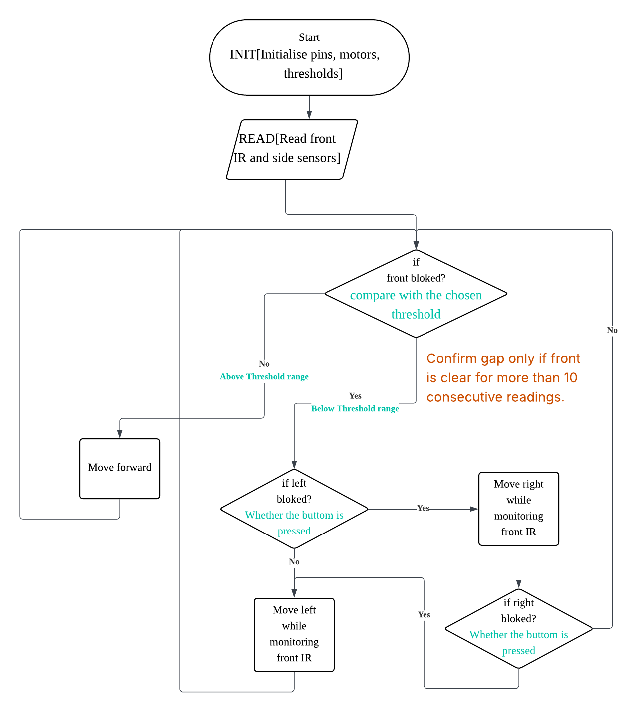

# Project Context

Arduino maze-solving robot project for Scenario B ELEC0035 UCL.

## Development Process

```text
Day 1: Read brief and clarify tasks
  ->
Day 1: Each member develops their subsystem
  ->
Day 2: Agree uniform interfaces for sensors, motors, encoders, and decision logic
  ->
Day 2: Role 1 builds the software framework
  ->
Day 3: Connect subsystem code into the main program
  ->
Day 3: Dry run with wheels raised and sensors tested
  ->
Final: Test in maze attempt 1
  ->
Final: Improve and test in maze attempt 2
  ->
Submit peer review
```

## Flow Chart

```text
1. Explanation:
  There's no wall ahead
  -> Keep going
  There is a wall ahead
      Is there a blockage on the left?
        Yes -> Move to the right
        No -> Move left

2. Use range instead of single number for a threshold to solve "an unstable front wall is detected";
3. While moving left or right, front-clear detection has priority over side-hit detection;
4. After detecting a gap, keep side movement until encoder distance shows the robot body has entered the gap.
```



## State Transition Notes

```text
R=1 indicates that the robot is in a square with a section of the red walls in front.
G=1 indicate that the robot is in a square adjacent to one of the green walls.
```

Original state transition diagram references from the README:

- `https://github.com/user-attachments/assets/71426a11-4d9e-4353-98ff-8dd7bd62e035`
- `https://github.com/user-attachments/assets/d2fd882f-0db2-47c2-ba22-3066f42dc209`

## Related Docs

- [Robot behavior](docs/robot_behavior.md)
- [Pin map](docs/pin_map.md)
- [Interface spec](docs/interface_spec.md)
- [Arduino setup](docs/setup_arduino.md)
- [Dummy framework demo](docs/dummy_demo.md)
- [Source brief documents](docs/briefs/)
